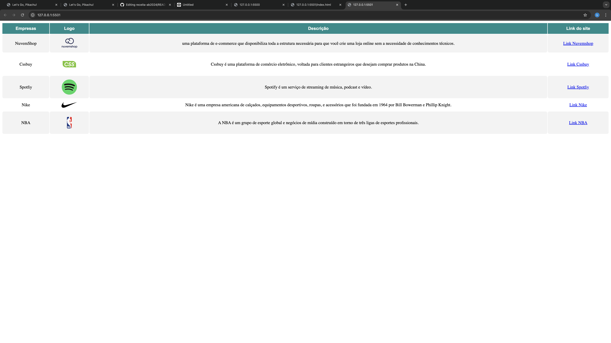

#  Receita Bolo Chocolate

## Sobre
Site de Receita com  o intuito desse projeto e colocar em pratica o conhecimento sobre linguaguem de marcaçao, HTML, CSS e Markdown, realizadas no curso tecnico de desenvolvimento de sistema do [SENAI Jandira](https://sp.senai.br/unidade/jandira/)
---
## Tecnologias utilizadas 
- HTML
- CSS
- Markdown
- Git

---
# Autor 
- [Bryan Martins]()
